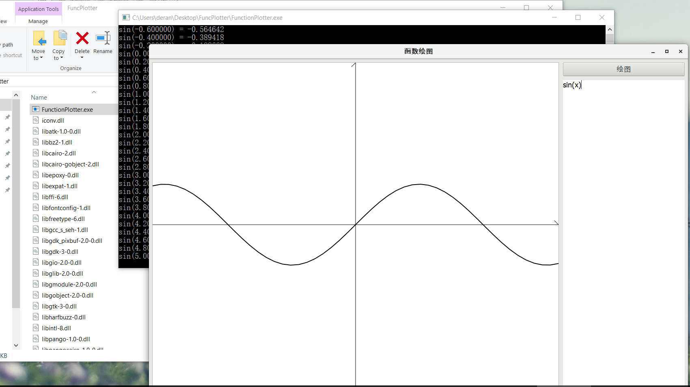
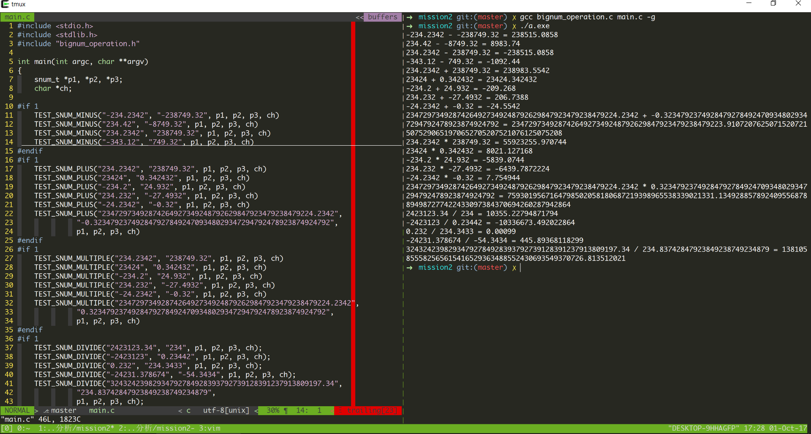
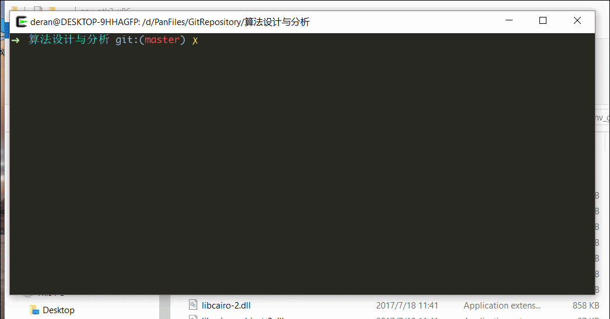
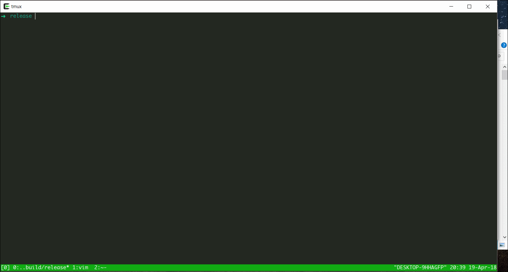

# SUST 课程作业

## 1.  编译和运行

```
# cygwin环境下 （编译linux程序）
SUSTSuanFaFenXiYuSheJi $ mkdir build && cd build
build $ ../configure
build $ make

x86_64-w64-mingw32 over cygwin 环境（编译window程序）
SUSTSuanFaFenXiYuSheJi $ mkdir x86_64-w64-mingw32-build && cd x86_64-w64-mingw32-build
build $ ../configure --host=x86_64-w64-mingw32
build $ make

# mission4 采用cmake构建，因此需要单独编译。
```


## 2. mission 1 - 函数绘图程序



　　Introduction：http://blog.csdn.net/panderang/article/details/78011502

　　Program：http://pan.baidu.com/s/1eS6aivo

## 3. mission 2 - 字符数加减乘除运算

　　计算示例如下：



## 4. mission 3 - K均值聚类算法C实现（二维）

　　演示实例如下：



## 5. mission4 - 求解连通图的生成树

### 5.1 输入文件编写说明

```
# input file
grpadj net {
    0 1 0 1
    1 0 1 1
    0 1 0 1
    1 1 1 0
    }
commnd spanningtree
```

1. \#号开头表示注释；

2. grpadj 表示这是一个图的邻接矩阵，是关键字；另一个是 grpinc 表示这是一个图的关联矩阵；

3. net 为图的名称，可指定任意名称。后跟空格再加 “{” 表示下一行为矩阵开始；

4. 矩阵输入结束后单独一行用 “}” 表示矩阵输入结束；

5. commnd 表示对该矩阵进行的操作，是关键字，后跟空格再接着输入操作名；

6. spanningtree 表示对求解矩阵的生成树；另一个操作名是display，表示输出该图的图像。目前就这两个操作。

上面的 data.input 文件表示对用邻接矩阵表示的图 net 求解其所有的生成树。 

### 5.2 执行求解

在命令行中键入以下程序即可运行求解。

```
# grptools data.input
```

### 5.3 结果输出

输出结果将存放着当前路径的 output 目录中，没有该目录将由程序新建。在 output 目录中 dotfiles 目录将存储由graphviz dot 语言描述的输出图的结构。pictures 目录中将存放生成的 png 图片。

### 5.4 例

